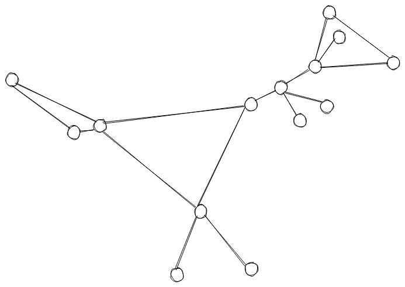

# Discreta II

## Clase Practica #2

1. Construya un autómata que reconozca el lenguaje L de las cadenas que son el resultado de concatenar un número positivo de veces la cadena "ab"
   1. Construya un autómata que reconozca el lenguaje de las cadenas que son el resultado de concatenar una cadena del lenguaje L y una cadena del lenguaje de todas las posibles cadenas sobre el alfabeto  {a, b}

2. Construya un autómata que reconozca el lenguaje de las cadenas *x2y* donde *x* y *y* son cadenas sobre el alfabeto {0, 1} tal que: 
   1. El número que representa cada una es divisible por 3.
   2. \* La suma de los números representados por las cadenas *x* y *y* es divisible por 3

3. Sea Q el conjunto de todas las listas no vacías de enteros positivos y L el conjunto de todas las cadenas sobre el alfabeto {0, 1}. Se define la función $f: Q \rightarrow L$ tal que:
   
    $f(l) = (1)^{a_1}0(1)^{a_2}0 \ldots 0(1)^{a_k}$ donde $l = \{a_1, a_2, ..., a_k\} \in Q$

   Por ejemplo, $f(2, 3, 2) = "110111011"$.
   
   Construya el autómata que reconoce el lenguaje de las cadenas que pertenecen a la imagen de f.

4. Determine el conjunto de longitudes posibles de las cadenas que reconoce el siguiente automata:

   ```mermaid
      graph LR
      ini[*]
      ini-->q0
      q0((q0))
      q1((q1))
      q2((q2))
      q3((q3))
      q4((q4))
      q5((q5))
      q6((q6))
      qf(((q7)))
      q0-- a -->q1
      q1-- a -->q0
      q1-- b -->q2
      q1-- c -->q3
      q3-- a -->q5
      q2-- a,c -->q4
      q5-- a -->q6
      q4-- b -->q6
      q6-- c -->qf
   ```

5. Construya el autómata que reconozca dado un camino, si este representa un ciclo simple en el siguiente grafo:
   
   
   
6. Construya el autómata que reconozca el lenguaje de las cadenas sobre el alfabeto {a, b, c} tales que contengan una 'a' en todas las posiciones pares excepto en las que son múltiplo de 3.