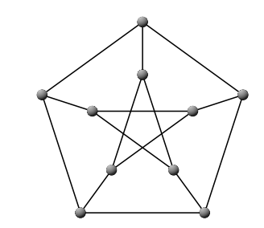

# Discreta II

## Clase Practica #7

1. Sea T un bosque de orden $n$, tamaño $m$ y $k$ componentes. Pruebe que $m = n − k$.
2. Sea $T$ un árbol de orden $n$ que solo contiene vértices de degree 1 o 3. Pruebe que $T$ contiene $(n − 2)/2$ vértices de degree 3.
3. Pruebe que si una arista es insertada entre 2 vértices no adyacentes de un árbol, el grafo resultante contiene exactamente un ciclo.
4. Pruebe que todo árbol en un grafo bipartito.
5. Sea $G$ bipartito y regular de grado $k$, entonces existen $k$ emparejamientos perfectos distintos.
6. Sea $G$ de orden $n$ tal que para todos $v,w$ no adyacentes $d(v)+d(w)\geq n-1$. Pruebe que existe un emparejamiento perfecto en $G$.
7. Pruebe que un árbol tiene a lo sumo un emparejamiento perfecto.
8. $G$ tiene una cadena de Euler si y solo si exactamente 2 nodos son de degree impar.
9. La longana más larga posible en el dominó es de 51 fichas
10. Sea $G$ conexo tal que todo vértice está contenido en un número impar de ciclos. Pruebe que $G$ es euleriano.
11. Si $G_1$ y $G_2$ son grafos obtenidos de $G$ con $n \geq 3$ agregando iterativamente pares de vértices no adyacentes tales que sus degrees sumen al menos n, entonces G1 = G2.
12. Si $G$ orden 3 o mayor. Pruebe que $G$ es hamiltoniano si solo si $cl(G)$ también lo es.
13. Si $G$ es conexo, bipartito y regular de grado $k$ entonces es 2-conexo.
14. Pruebe que $K_{n,n+1}$ es no hamiltoniano para todo $n\geq 1$.
15. Sea $G$ un subgrafo abarcador de $K_{n,n}(n\geq 2)$ cuyas particiones son $V_1$ y $V_2$. Sean $u\in V_1$ y $v\in V_2$ tales que $d(u)+d(u)\gt n$. Pruebe que $G$ es hamiltoniano si solo si $G+uv$ también lo es.
16. Pruebe que el grafo de Petersen es no hamiltoniano. 

